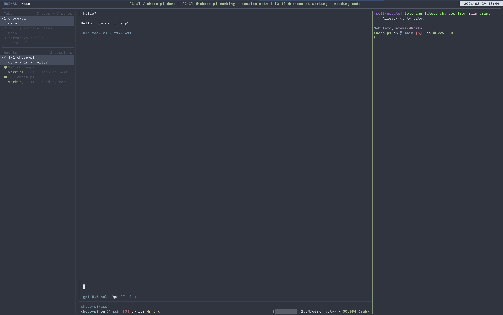

# zellij-vertical-tabs

[English](README.md) | 한국어

가로 상태 표시줄과 세로 사이드바를 제공하는 Zellij WebAssembly 플러그인입니다. 탭, 저장소, 브랜치, 연결된 워크트리 상태와 시계, choco-pi, Claude Code, Codex 및 터미널에서 감지한 코딩 에이전트의 상태를 표시합니다.



## 설치

릴리스 파일 하나를 두 이름으로 저장합니다. Zellij는 URL을 기준으로 플러그인 인스턴스를 구분하므로, 두 보기를 같은 레이아웃에서 사용하려면 서로 다른 URL이나 파일 경로가 필요합니다.

```sh
mkdir -p ~/.config/zellij/plugins
curl -fL https://github.com/Nebu1eto/zellij-vertical-tabs/releases/latest/download/zellij-vertical-tabs.wasm \
  -o ~/.config/zellij/plugins/vertical-tabs.wasm
cp ~/.config/zellij/plugins/vertical-tabs.wasm \
  ~/.config/zellij/plugins/vertical-sidebar.wasm
```

처음 실행할 때 각 플러그인 창에 포커스를 두고 `y`를 눌러 요청된 권한을 허용합니다.

## 설정

다음 레이아웃은 서로 다른 경로에서 가로 보기와 세로 보기를 불러옵니다. 백분율 크기를 사용하면 사이드바의 초기 너비를 정하면서도 나중에 크기를 조절할 수 있습니다.

```kdl
layout {
    pane size=2 borderless=true {
        plugin location="file:~/.config/zellij/plugins/vertical-tabs.wasm" {
            view "horizontal"
            show_tabs "true"
            timezone_offset_hours "9"
        }
    }
    pane split_direction="vertical" {
        pane
        pane size="30%" borderless=true {
            plugin location="file:~/.config/zellij/plugins/vertical-sidebar.wasm" {
                view "vertical"
                home "/Users/example"
                vertical_separator_enabled "true"
                vertical_separator_char "│"
            }
        }
    }
}
```

주요 설정 키는 다음과 같습니다.

| 키 | 값 또는 용도 |
| --- | --- |
| `view` | `"horizontal"` 또는 `"vertical"` |
| `show_tabs` | 가로 탭 표시 여부. 기본값은 `"true"` |
| `timezone_offset_hours` | UTC 기준 시계 오프셋(시간) |
| `home` | 작업 디렉터리를 표시할 때 사용할 홈 경로 |
| `vertical_separator_enabled` | 사이드바 구분선 표시 여부. 기본값은 `"true"` |
| `vertical_separator_char` | 사이드바 구분선 문자. 기본값은 `"│"` |
| `border_enabled` | 사이드바 구분선과 별개인 가로 보기 테두리 사용 여부 |
| `border_char` | 가로 보기 테두리 문자 |

색상에는 `#RRGGBB` 또는 `RRGGBB` 형식을 사용합니다. 값이 올바르지 않으면 내장 Nord 기본값을 사용합니다. 다음 키를 설정할 수 있습니다.

```text
color_background
color_session_fg  color_session_bg
color_mode_normal_fg  color_mode_normal_bg
color_mode_locked_fg  color_mode_locked_bg
color_mode_resize_fg  color_mode_resize_bg
color_mode_pane_fg  color_mode_pane_bg
color_mode_tab_fg  color_mode_tab_bg
color_mode_search_fg  color_mode_search_bg
color_mode_rename_tab_fg  color_mode_rename_tab_bg
color_mode_rename_pane_fg  color_mode_rename_pane_bg
color_mode_move_fg  color_mode_move_bg
color_mode_default_fg  color_mode_default_bg
color_tab_normal_fg  color_tab_normal_bg
color_tab_active_fg  color_tab_active_bg
color_cwd_normal_fg  color_cwd_normal_bg
color_cwd_active_fg  color_cwd_active_bg
color_context_fg  color_context_bg
color_clock_fg  color_clock_bg
color_border_fg  color_border_bg
color_agent_fg  color_agent_bg
color_agent_urgent_fg  color_agent_urgent_bg
```

## 코딩 에이전트 상태

훅을 설정하지 않아도 플러그인이 지원하는 터미널 에이전트 프로세스를 감지합니다. 훅을 사용하면 다음 이름의 파이프로 JSON을 보내 수명 주기와 작업 세부 정보를 추가할 수 있습니다.

```sh
zellij pipe --name coding-agent-status -- "$payload"
```

JSON에는 창, 이벤트, 도구, 작업 요약, 에이전트 종류, 타임스탬프를 넣을 수 있습니다. choco-pi, Claude Code, Codex의 훅 이벤트는 해당 창의 상태를 갱신합니다.

## 빌드

WASI 타깃을 설치하고 릴리스 파일을 빌드합니다.

```sh
rustup target add wasm32-wasip1
cargo build --release
```

빌드 결과는 다음 경로에 생성됩니다.

```text
target/wasm32-wasip1/release/zellij-vertical-tabs.wasm
```

## 릴리스

CI는 포맷, Clippy, 테스트, 릴리스 WASM 빌드를 검사합니다. 릴리스를 게시하려면 다음 순서로 진행합니다.

1. `Cargo.toml`의 `version`을 `MAJOR.MINOR.PATCH`로 설정합니다.
2. 변경 사항을 커밋하고 푸시합니다.
3. 같은 버전의 태그를 만들고 푸시합니다.

   ```sh
   git tag vMAJOR.MINOR.PATCH
   git push origin vMAJOR.MINOR.PATCH
   ```

릴리스 워크플로는 `Cargo.toml` 버전과 일치하는 엄격한 `vMAJOR.MINOR.PATCH` 형식의 태그만 허용합니다. 조건을 충족하면 공개 GitHub Release를 만들고 `zellij-vertical-tabs.wasm` 파일을 업로드합니다.

## 라이선스

[MIT](LICENSE)
